# DLCCoordMapper

<div align="center">


**Interactive video calibration tool that maps camera pixel coordinates to world coordinates**

[](https://www.python.org/)
[](https://opencv.org/)
[](https://opensource.org/licenses/MIT)
[](https://deeplabcut.github.io/DeepLabCut/)

</div>

---

## 🎯 Features

<table>
<tr>
<td width="50%">

### 📹 Video Processing
- Frame-by-frame video navigation
- Real-time calibration point selection
- Interactive video playback controls

</td>
<td width="50%">

### 🔬 DeepLabCut Integration
- Automatic CSV data parsing
- Body part coordinate extraction
- Multi-bodypart support

</td>
</tr>
<tr>
<td width="50%">

### 🎮 Interactive Controls
- Intuitive keyboard shortcuts
- Real-time feedback
- Undo/redo functionality

</td>
<td width="50%">

### 📊 Precision Analysis
- Homography matrix calculation
- Error metrics and validation
- Data persistence with pickle

</td>
</tr>
</table>

---

## 🚀 Quick Start

### Prerequisites

```bash
# Install required packages
pip install opencv-python numpy pandas
```

### Installation

```bash
# Clone the repository
git clone https://github.com/yourusername/DLC-VideoCalibrator.git
cd DLC-VideoCalibrator

# Install dependencies
pip install -r requirements.txt

# Run the calibrator
python main.py
```

---

## 💡 Usage Workflow

```mermaid
graph TD
    A[Start Application] --> B[Set World Coordinates]
    B --> C[Load Video File]
    C --> D[Load DeepLabCut CSV]
    D --> E[Select Body Part]
    E --> F[Navigate Video Frames]
    F --> G[Add Calibration Points]
    G --> H{Enough Points?}
    H -->|No < 4| F
    H -->|Yes ≥ 4| I[Calculate Homography]
    I --> J[Validate Results]
    J --> K[Save Calibration Data]
```



### Step-by-Step Guide

1. **🎛️ Configuration**
   - Set world coordinate range and calibration point count
   - Configure precision requirements

2. **📁 File Selection**
   - Choose your experiment video file
   - Load corresponding DeepLabCut CSV data

3. **🎯 Calibration Process**
   - Navigate to frames with clear reference points
   - Press `C` to add calibration points using DLC coordinates
   - Use `R` to remove incorrectly placed points

4. **✅ Validation & Export**
   - Review error metrics (aim for average error < 2.0)
   - Save calibration data for future use

---

## ⌨️ Keyboard Controls

<div align="center">

| Key | Function | Description |
|:---:|:---------|:------------|
| `Space` | **Play/Pause** | Toggle video playback |
| `A` / `D` | **Frame Navigation** | Previous/Next frame (when paused) |
| `C` | **Add Point** | Add calibration point at current frame |
| `R` | **Remove Point** | Delete last calibration point |
| `ESC` | **Exit** | Exit calibration mode |

</div>

---

## 📊 Example Output

```python
# Calibration Progress
✓ Added calibration point 1: World (0.0, 0.0) → Pixel (150.3, 200.1)
✓ Added calibration point 2: World (75.0, 0.0) → Pixel (600.5, 210.7)
✓ Added calibration point 3: World (75.0, 50.0) → Pixel (580.2, 180.4)
...

# Calibration Results
🎉 Calibration Complete!
   📍 Total Points: 10
   📏 Average Error: 0.42 pixels
   📐 Maximum Error: 0.85 pixels
   ✅ Calibration Quality: Excellent
```

---

## 📁 Project Structure

```
DLC-VideoCalibrator/
├── 📄 main.py                 # Main application entry point
├── 🔧 calibration_tool.py     # Core calibration functionality
├── 📋 requirements.txt        # Python dependencies
├── 📖 README.md              # This documentation
├── 📂 docs/
│   └── 🖼️ screenshot_placeholder.png
├── 📂 examples/
│   ├── 🎥 sample_video.mp4   # Demo video file
│   └── 📊 sample_dlc.csv     # Demo DeepLabCut data
└── 📂 calibrations/          # Saved calibration files
    └── 💾 *.pkl              # Pickle files with calibration data
```

---

## 📋 Sample Data Format

Your DeepLabCut CSV should follow this structure:

```csv
scorer,bodypart,x,y,likelihood
DLC_resnet50_projectname,nose,245.67,189.23,0.9876
DLC_resnet50_projectname,nose,247.12,190.45,0.9823
DLC_resnet50_projectname,tail,423.89,267.34,0.9654
DLC_resnet50_projectname,tail,425.67,268.91,0.9712
```

### 🔍 Data Requirements

- **Minimum Points**: 4 calibration points (more recommended)
- **Optimal Range**: 8-15 evenly distributed points
- **Coordinate System**: Consistent world coordinate reference
- **Quality Threshold**: Average error < 2.0 pixels

---

## ⚠️ Important Notes

> **🎯 Calibration Tips**
> - Distribute calibration points evenly across the field of view
> - Use frames where the selected body part is clearly visible
> - Avoid points near image borders for better accuracy

> **🔧 Troubleshooting**
> - High average error (>2.0): Reselect calibration points
> - Matrix calculation fails: Ensure points are not collinear
> - CSV loading issues: Check DeepLabCut output format

---

### 👥 Contributors

<ul>
  <li>
    <a href="https://github.com/YangziiiiiChen/" target="_blank">
      <b>Yangzi Chen</b>
    </a> - Creator & Maintainer
  </li>
</ul>


---

## 📄 License

This project is licensed under the **MIT License** - see the [LICENSE](LICENSE) file for details.

```
MIT License

Copyright (c) 2024 Yangzi Chen

Permission is hereby granted, free of charge, to any person obtaining a copy
of this software and associated documentation files (the "Software"), to deal
in the Software without restriction, including without limitation the rights
to use, copy, modify, merge, publish, distribute, sublicense, and/or sell
copies of the Software, and to permit persons to whom the Software is
furnished to do so, subject to the following conditions:

The above copyright notice and this permission notice shall be included in all
copies or substantial portions of the Software.
```

---

<div align="center">

**⭐ If this tool helped your research, please give it a star! ⭐**

Made with ❤️ for the DeepLabCut community

</div>
